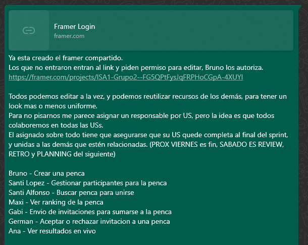
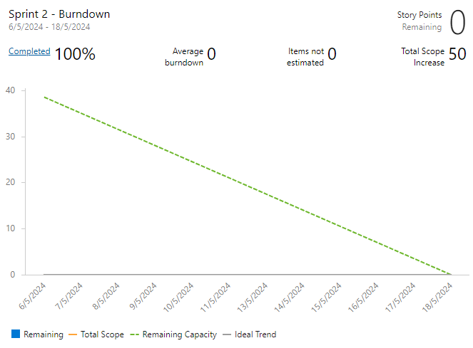
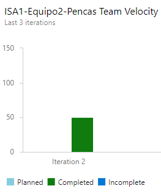
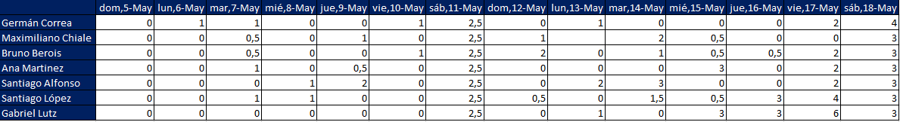

# Daily Scrums

Como ejemplo se incluye ejemplo de la asistencia de los integrantes del equipo a las reuniones virtuales por Teams.

También capturas de mensajes para la version "offline"

 
 
 

## Minuta de cada Daily Scrum

El SCRUM Master:
  - Recuerda el objetivo del Sprint.
  - Da el tiempo a que cada integrante del equipo de su reporte.
  - Comparte el Burndown chart con el equipo y se discute sobre como venimos respecto al ideal.
  - Asigna tareas del Sprint Backlog a quien se queda sin tareas
  - Si alguien reporta un bloqueo, se discute con el equipo quien el mejor que le ayude.
  - Reasigna tareas, según se entienda que es lo mejor para alcanzar los objetivos del Sprint.
  - Recuerda al equipo, tener presente de identificar lo antes posible, dependencias de recursos externos al equipo, para poder resolverlas y que no se transformen en elementos bloqueantes.
  - Si hay que tomar decisiones sobre priorización de tareas, al contar con el Product Owner en la reunión, lo invoca inmediatamente para poder tomar esa decisión durante la reunión, y ajustar los planes sin tener que esperar.

Cada integrante del equipo responde:

  - ¿En qué pudo avanzar? 
    - Avances, User Stories y Tasks que se terminaron. Dependencias que se resolvieron y que habilitan que otras cosas que dependen de ellas puedan avanzar.
    - Si hay elementos listos para revisar si se cumple con el Definition of Done.

  - ¿Qué tiene planificado hacer?
    - Tareas hasta la próxima Daily Scrum en las que se va a trabajar.
    - Si no tiene mas tareas debe indicarlo para poder asignarle mas tareas.

  - ¿Qué impedimentos tiene?
    - Si hay algo que nos bloquea el avance, reportarlo para conseguir ayuda.

## Seguimiento de la iteración

### Burndown chart

No se cuenta aun con esta herramienta, dado que no lo vimos en todavía en el curso.

Se incluye captura una vez finalizado el Sprint.

### Dedicacion horaria

Se incluye una planilla con el tiempo dedicado por cada uno de los integrantes del equipo.

