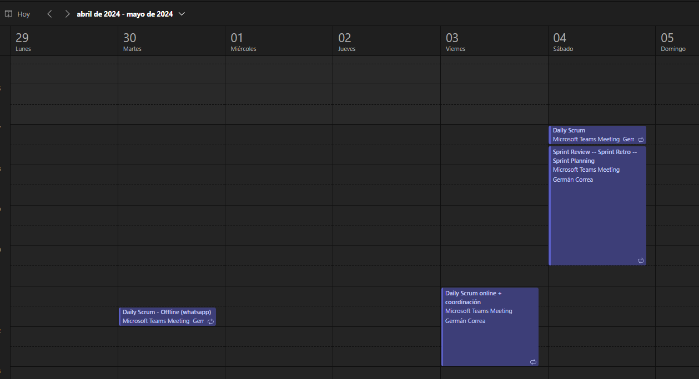
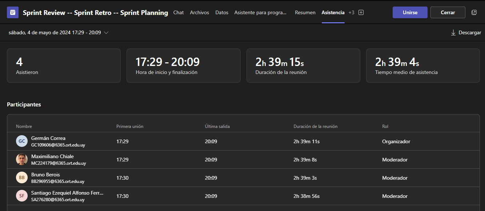
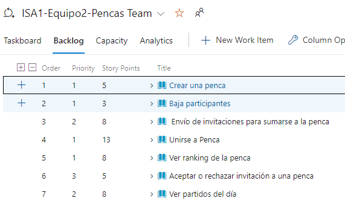
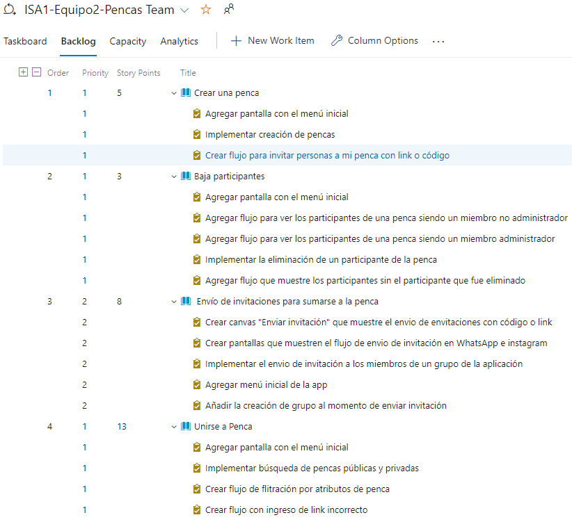
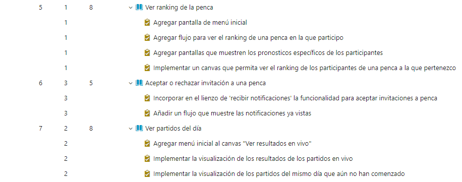

# Sprint Planning

### Cita

Realizada el 4/5/2024

Asistencia

 

## Agenda

- Establecer la capacidad del equipo para cada integrante en horas
- Repasar la Velocity del equipo en los sprint anteriores, hasta donde se pueda establecer (mejor, peor, promedio).
- Definir los objetivos de la iteración
- Seleccionar del backlog general priorizado, el conjunto de UserStories que se desean incluir en el Sprint alineadas con ese objetivo, contemplando las que aporten el mayor valor.
- Actualizar la estimación de esas UserStories
- Hacer el breakdown en Tasks de las US seleccionadas
- Hacer las estimaciones de las Tasks en horas.
- Estableder la prioridad de las UserStory dentro del Sprint, según el valor aportado
- Hacer las asignaciones de acuerdo a la capacidad de cada integrante

## Ejecución

### Capacidad del equipo

Se toma una **capacidad de 5hs/persona/semana** en promedio, que se utilizará para la implementación de las User Stories que se planifiquen, mas las actividades de aprendizaje de las herramientas a utilizar.

### Velocity de sprints anteriores

No se tiene referencia porque es el primer Sprint en el que se va a trabajar en producir un incremento del producto.

### Objetivos de la iteración

- Familiarizarse con las herramientas, y el proceso Scrum, y con la prototipación.
- Implementar las User Stories que aporten mas valor al cliente

### User Stories seleccionadas para incluir en el Sprint

**Criterios utilizados en la planificación:**
- Se seleccionaron las User Stories que eran mas prioritarias según el valor que se entienden aportan al cliente, según los resultados del Analisis Inicial.
- Se eligieron menos User Stories para este Sprint, que para el siguiente porque el equipo no tiene conocimiento profundo aún de las herramientas, ni del proceso, y tampoco una referencia por trabajo realizado anteriormente.

Se ajustan las prioridades de las User Stories según el valor que aportan en conjunto con el Product Owner.

Se estiman las User Stories, y se seleccionan las siguientes para agregar al Sprint Backlog.

Se incluye una captura de los elementos del Sprint Backlog para la Itreación 2.

 

Se incluye también la vista del Story Map para visualizar la relación de las mismas con las Epicas de funcionalidad.

 

La técnica de estimación utilizada fué la de Story Points utilizando números de Fibnoacci.

Se incluye planilla con las estimaciones realizadas por el equipo.

### Sprint backlog final

Luego de hacer el breakdown en tareas de cada User Story y estimarlas, se incluyen la captura de las Task y User Stories que quedaron para el Sprint, una vez asignadas.

