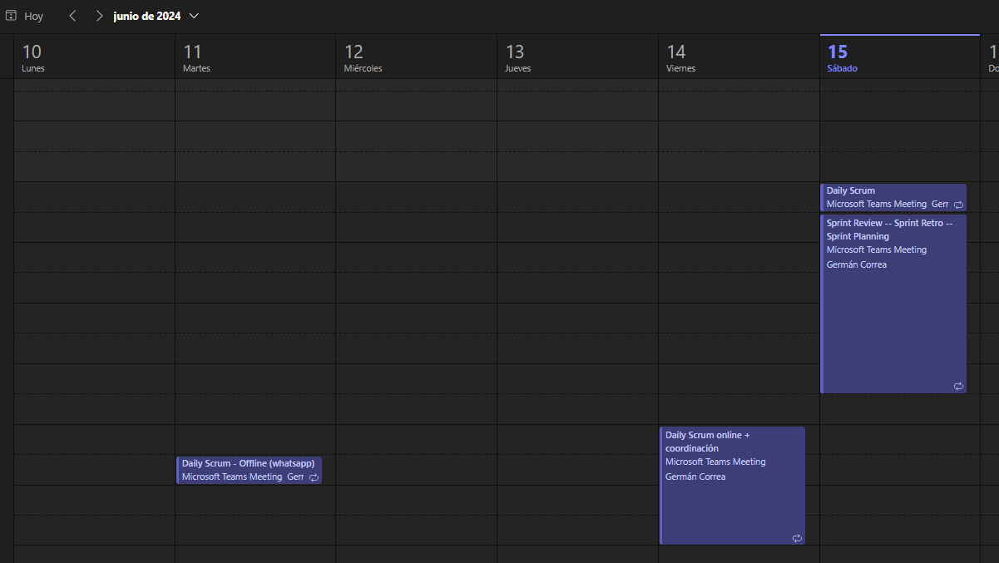
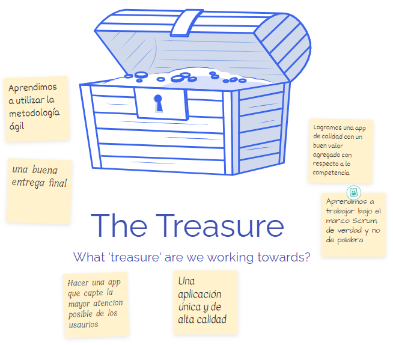

# Sprint Retrospective

En esta ocasion para la retrospective, utilizamos la herramienta metro retro con el template de "The Good, The Bad, and The Ugly".

En las imagenes a continuacion se pueden ver los 4 items: las cosas buenas, las malas, las que pueden mejorar, el objetivo principal y tambien las acciones a tomar para mejorar en futuras iteraciones.

Tambien se puede acceder desde el siguiente [link](https://metroretro.io/BOZ4U8F3PHPO).

 

 

 

 

 

