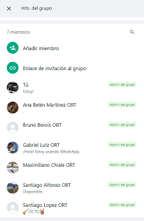

# Indice

- [Gestión de la iteración](#gestión-de-la-iteración)
  - [Definición del marco de trabajo](#definición-del-marco-de-trabajo)
  - [Planificación de la iteración](#planificación-de-la-iteración)
  - [Seguimiento de la iteración](#seguimiento-de-la-iteración)
  - [Inspección y adaptación del proceso](#inspección-y-adaptación-del-proceso)
- [Identificar y definir el problema a resolver](#identificar-y-definir-el-problema-a-resolver)
  - [Identificación del problema a resolver](#identificación-del-problema-a-resolver)
  - [Definición del problema/solución](#definición-del-problema/solución)

# Gestión de la iteración

## Definición del marco de trabajo

_[Definición del marco de trabajo SCRUM con los acuerdos principales del equipo y evidencia de sus prácticas aplicadas en la iteración. Deben estar los roles definidos para cada integrante del equipo y la justificación de la adaptación del marco de trabajo al contexto de la iteración.]_

Se decidió utilizar SCRUM para este proyecto sobre la aplicación de pencas deportivas. Se establecieron los acuerdos detallados a continuación para adaptarse a la realidad de los integrantes.

#### Roles:
- Product Owner: [Nombre]. define y prioriza los elementos del Backlog en función del valor para el usuario y el negocio.
- Scrum Master: [Nombre]. Se encarga de llevar adelante y asegurar que se realicen los eventos SCRUM. .
- Development Team: [Nombres]. Responsables de desarrollar los incrementos.

### Artefactos principales

- Definición del calendario de eventos con justificación de su adaptación al contexto de la iteración.
- Roles y responsabilidades definidos para cada integrante del equipo.
- Políticas de trabajo del equipo:
  - Definition of Done.
  - Definition of Ready.

#### Eventos:
- **Daily Scrum**: Dentro de las adpataciones del marco de trabajo se realizarán adaptaciones que se describen mas adelante. Esto se justifica porque dado que muchos de los integrantes del equipo trbajan y estudian, además de las responsabilidades familiares que cada uno tiene, solo es viable coincidir en ciertos horarios que son los que se han definido a continuación.

La coordinación y los intercambios se realizarán por whatsapp, en el grupo creado para ese fin llamado: 
`ORT - ISA1 - Equipo2`

 

Los martes en la noche, se realizara una Daily Scrum "offline" donde cada integrante mandará su actualización en forma de mensaje por whatsapp, incuyendo:
  - ¿Que pudo avanzar?
  - ¿Qué es lo próximo que va a realizar?
  - ¿Si tiene algún impedimento para avanzar?

Los viernes a las 21hs se realizará una reunión por Teams (daily scrum "online"), para tratar los mismos temas en la primera parte, y luego se tiene tiempo agendado para otras coordinaciones que sean necesarias.

Los sábados se realizará una daily scrum "online" por teams, previo a la Sprint Review, Retro y Planning.

Por lo tanto al agenda semanal para las Daily Scrums queda de la siguiente forma.
 

- **Sprint Planning**: Al comienzo de cada iteración, luego de la Sprint Retrospective del sprint anterior, para definir los objetivos del Sprint y seleccionar los elementos del Backlog a incluir en el Sprint Backlog

- **Sprint Review**: Al final de cada iteración para revisar el incremento desarrollado y recopilar feedback. Esta reunión se agendó para los sábados luego de la daily, para poder tener este feedback antes de la Retro de forma de poder tener mas insumos para la Retro y Planning que vienen a continuación.

- **Sprint Retrospective**: Se definió tenerla luego del final de cada iteración y luego de la Sprint Review para poder incluir tambien como insumo el feedback recibido en la Sprint Review, y de esa manera poder identificar mejor elementos del proceso que sean necesarios modificar o mejorar. También consideramos incluirla antes de la Sprint Planning para que si a raiz de la Retro surgen Action Items que realizar, estos se puedan incluir en el backlog para poder ser tenidos en consideración en la planificación del siguiente sprint.

Como resultado de estas definiciones de los eventos Scrum para el proyecto, en las semanas que finaliza el Sprint esta sería la agenda definida.
 

##### Evidencias

[Daly Scrum](Daily-Scrum.md)

#### Definiciones:
- Done: los elementos del Backlog completados durante el Sprint deben cumplir con los criterios de aceptación definidos, estar probados y listos para su entrega.

- Ready: los elementos del Backlog deben estar claros, tener criterios de aceptación definidos y ser priorizados antes de ser seleccionados para su inclusión en el Sprint.

## Planificación de la iteración

_[Sprint Backlog para cumplir con el objetivo de la iteración. Debe contener las historias de usuario priorizadas y las tareas planificadas basadas en la capacidad y velocidad disponible del equipo.]_

### Artefactos principales

- Minuta de la sprint planning con su agenda, actividades y resultados.
- Objetivos de la iteración.
- Sprint backlog con historias de usuarios y tareas asociadas.
- Planificación de acuerdo a la capacidad del equipo.
- Técnicas de priorización y estimación utilizadas.

## Seguimiento de la iteración

_[Existe evidencia sobre el registro de actividades y horas de cada integrante del equipo con el seguimiento general de cada iteración del proyecto sobre lo planificado inicialmente.]_

### Artefactos principales

- Minuta de daily scrum describiendo la coordinación del trabajo de cada integrante del equipo.
  - ¿Que logramos hacer?
  - ¿Qué planificamos hacer?
  - ¿Qué impedimentos tenemos?
- Registro y reporte de horas de cada integrante del equipo con sus actividades principales.
- Seguimiento visual de la iteración con burndown y/o burnup charts.

## Inspección y adaptación del proceso

_[Existe evidencia sobre la inspección del proceso con aprendizajes principales y acciones de mejora implementadas durante el desarrollo del proyecto.]_

### Artefactos principales

- Minuta de la retrospectiva con la dinámica utilizada y sus principales resultados.
- Planificación y seguimiento de las acciones de mejora.

# Identificar y definir el problema a resolver

## Identificación del problema a resolver

_[Entendimiento claro del problema del negocio a resolver con la identificación de los usuarios y escenarios principales con su valor de negocio asociado. Existe a su vez evidencia que se analiza y compara aplicaciones similares existentes del mercado.]_

El problema a resolver que se nos plantea, es la identificación de los distintos perfiles de usuarios y sus requerimientos y/o expectativas con respecto a una aplicación de pencas deportivas.
Para ello, realizamos encuestas a personas de diferentes edades (14 a 70 años) y ambientes sociales, para poder identificar necesidades claves dentro de la aplicación a desarrollar, y a su vez, usar como base de discusión otras aplicaciones ya existentes (Ovación, Supermatch, Montevideo Portal, Pencas Personales), para poder identificar fácilmente cuáles son las características que más le gustan de dicha aplicación y qué otras funcionalidades le gustaría que tuviese la aplicación que actualmente no proporciona.

### Artefactos principales

- Identificación de interesados con sus perfiles asociados.
- Lista de funcionalidades por cada interesado.
- Análisis y estudio de competidores.

## Definición del problema/solución

_[Existe un Product Backlog definido con su jerarquía de épicas e historias de usuario con sus criterios de aceptación asociados. Existe una priorización de los prototipos principales que se buscarán idear, construir y validar como parte del ciclo de descubrimiento.]_

### Artefactos principales

-Product backlog:

- Product backlog con épicas e historias de usuario para prototipar.
- Historias de usuario cumpliendo el Definition of Ready con sus criterios de aceptación.
- Propuesta de valor diferenciadora de la competencia.
- Story map del roadmap inicial del proyecto.

