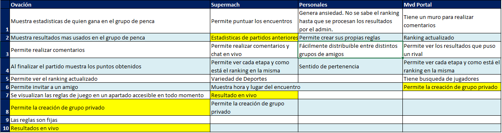

# Relevamiento de APPs y feedback inicial de usuarios

### Relevamiento interno

El equipo realizó un relevamiento de las aplicaciones de pencas y las principales funcionalidades que estas proveen.

Se consolidaron los resultados en la siguiente tabla.

### Relevamiento con usuarios

También en el relevamiento con usuarios se les preguntó:
- cuales son las dos funcionalidades de esas aplicaciones ellos valoran mas.
- alguna funcionalidad que les gustaría tener que la App que usan no tiene
- que funcionalidad, no les gusta o les parece muy compleja de usar de esa App

Se consolidaron los resultados en la siguiente tabla.

Al consolidar la información en la tabla, se resumieron los conceptos y unificaron en un mismo texto los que eran coincidentes. Se indica en colores algunos comentarios coincidentes entre los usuarios.

## Elementos a considerar para la propuesta de valor

De estos resultados se obtuvieron las siguientes funcionalidades sugeridas que se desearía incluir en la App a desarrollar y que constituyen la propuesta de valor que será un diferencial a favor de la nueva App.

### Mostrar últimos resultados entre sí

Esto implica que los usuarios puedan visualizar el historial de los ultimos partidos con los mismos equipos para los que está ingresando un pronóstico.

**Decisión**: El equipo de proyecto decide que aporta un valor que puede interesar a una cantidad de usuarios, y que es viable realizar dentro de los tiempos del proyecto. Por lo tanto se incluye.

### Ver apuestas oficiales

A la hora de realizar los pronósticos el usuario tendrá la posibilidad de ver la valoración que los sitios de apuestas dan para ese encuentro.

**Decisión**: El equipo de proyecto decide que aporta un valor que puede interesar a una cantidad de usuarios, y que es viable realizar dentro de los tiempos del proyecto. Por lo tanto se incluye.

### Link al Instagram de cada club

La idea es que se pueda acceder a la cuenta oficial de Instagram de los equipos desde los lugares de la App donde se ingresa o ve información de los equipos.

**Decisión**: El equipo de proyecto decide que aporta un valor que puede interesar a algunos usuarios, pero se entiende que esto llevaría un esfuerzo significativo adicional que comprete la realización dentro de los tiempos del proyecto. Por lo tanto dada la relación de valor / esfuerzo estimada, el equipo decide NO incluirla.

### Ver estadísticas de jugadores y expulsiones

A la hora de ingresar pronósticos, se plantea poder ver las estadísticas de los jugadores de cada equipo, de forma que el usuario sienta que puede hacer un pronóstico mas informado.

**Decisión**: El equipo de proyecto decide que aporta un valor que puede interesar a algunos usuarios mas detallistas o "metidos" en el tema, pero quizás no tanto para el usuario que solo quiere pronosticar para participar. El equipo entiende que implementar esta función, lleva un gran esfuerzo que compromete la realización dentro de los tiempos del proyecto. Pero para dejar cautivo a ese grupo de usuarios interesado en este tipo de característica, el equipo decide implementar una comparativa de los mejores jugadores de cada equipo.

### Mostrar últimos partidos de cada equipo

Se plantea que a la hora de ingresar los pronósticos se pueda ver los últimos partidos de cada uno de los equipos, para pode hacer un pronóstico mas informado.

**Decisión**: El equipo de proyecto decide que aporta un valor que puede interesar a un grupo de usuarios importante "metidos" en el tema. Sin embargo como ya se decidió incluir los últimos resultados de los partidos entre los mismos equipos, el equipo entiende que no aporta mucho valor adicional para el esfuerzo requerido. Por lo tanto NO se incluirá.

### Resumen del partido

Al finalizar un encuentro se quisiera poder visualizar el resumen del encuentro incluyendo las estadísticas del mismo.

**Decisión**: El equipo de proyecto entiende que esta funcionalidad puede abarcar varias cosas como por ejemplo cortos de video de los goles, o principales jugadas, estadísticas generalies, o por jugador. Esto se entiende que puede ser deseado por una gran cantidad de equipos. Dado que abarca muchas cosas, el equipo decide acotar esta funcionalidad a poder Ver los detalles de un partido, la cual mostrará las estadísticas del encuentro. Por lo tanto se incluye con ese alcance acotado.