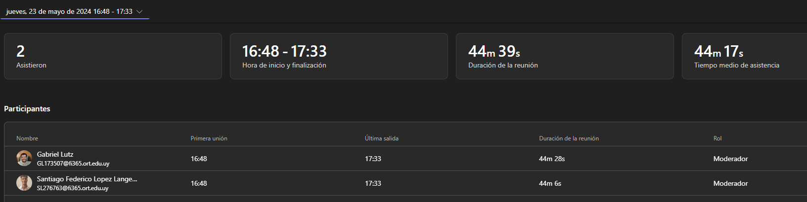
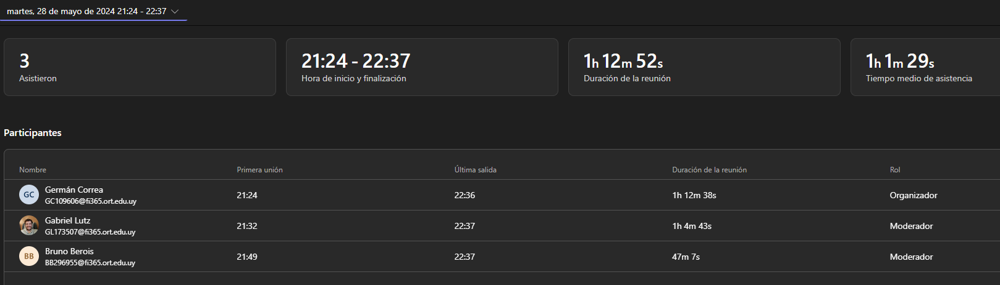
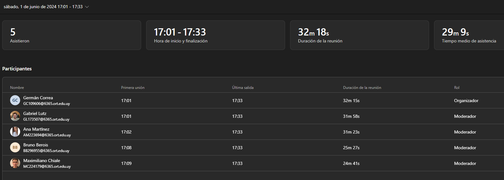

# Daily Scrums

Como ejemplo se incluye ejemplo de la asistencia de los integrantes del equipo a las reuniones virtuales por Teams.

Temas tratados:

  - ¿Que logramos hacer?
  - ¿Qué planificamos hacer?
  - ¿Qué impedimentos tenemos?

  ## Seguimiento de la iteración

Se incluye una planilla con el tiempo dedicado por cada uno de los integrantes del equipo.

Tareas principales realizada por cada integrante del equipo:

- Maxi
  - Participación en las distitnas reuniones
  - Creación de historias de usuario
  - Trabajo en Framer
  
- Bruno
  - Reuniones
  - Realizar una primera versión de la Creación de Pencas
  - Creación/Modificación de User Stories

- Santiago Alfonso
  - Reuniones
  - Trabajo en Framer

- Santiago Lopez
  - Reuniones
  - Trabajo en Framer

- Belén Martinez
  - Reuniones
  - Realizar prototipo en Framer

- Gabi
  - Reuniones
  - Trabajo en Framer

- Germán
  - Reuniones
  - Creación/Modificación/Adustes de User Stories
  - Trabajo en Framer
  - Escribir en archivos de Github