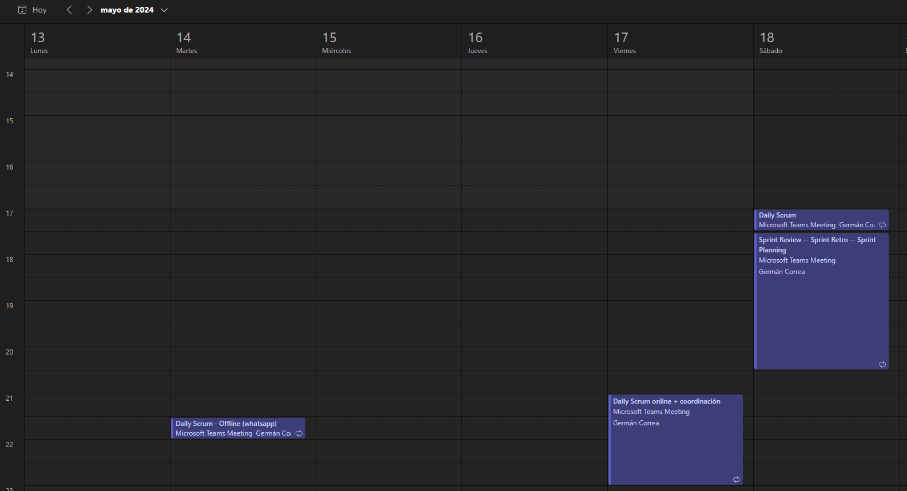
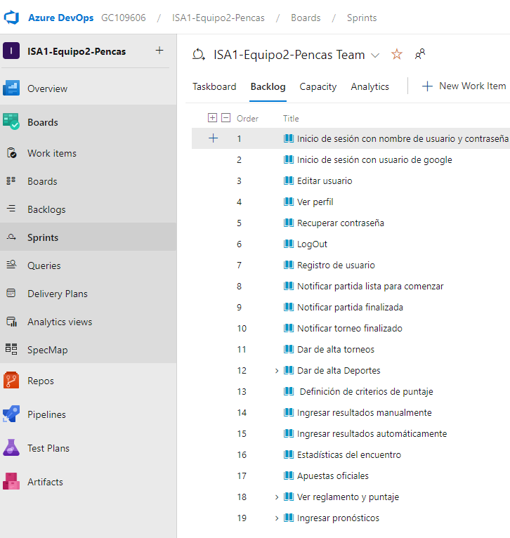
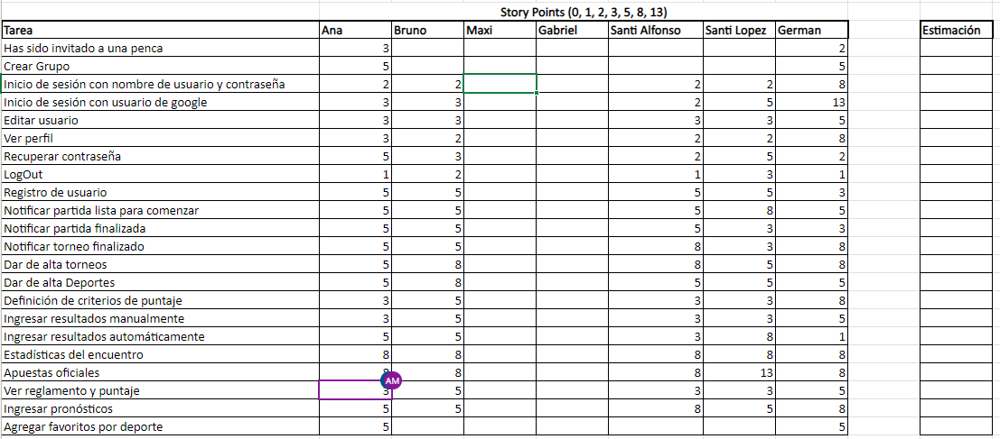
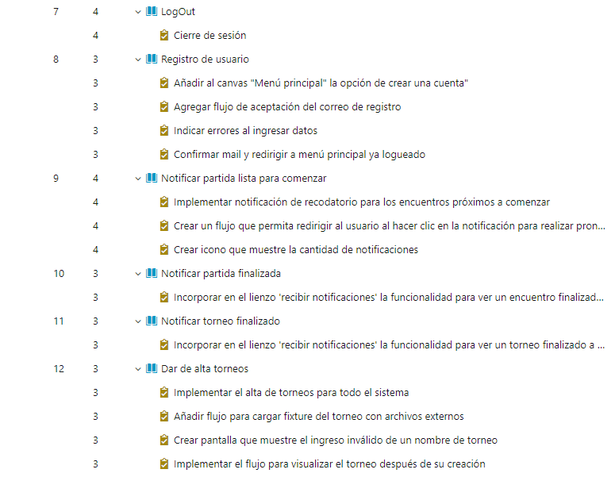

# Sprint Planning

### Cita

Realizada el 18/5/2024

 

 

## Agenda

- Establecer la capacidad del equipo para cada integrante en horas
- Repasar la Velocity del equipo en los sprint anteriores, hasta donde se pueda establecer (mejor, peor, promedio).
- Definir los objetivos de la iteración
- Seleccionar del backlog general priorizado, el conjunto de UserStories que se desean incluir en el Sprint alineadas con ese objetivo, contemplando las que aporten el mayor valor.
- Actualizar la estimación de esas UserStories
- Hacer el breakdown en Tasks de las US seleccionadas
- Hacer las estimaciones de las Tasks en horas.
- Estableder la prioridad de las UserStory dentro del Sprint, según el valor aportado
- Hacer las asignaciones de acuerdo a la capacidad de cada integrante

## Ejecución

### Capacidad del equipo

Se establece que el equipo dedicará el doble de capacidad que lo requerido (5hs/persona) en este sprint para poder quedar libres o con una dedicación mínima para el siguiente Sprint.
O sea que se toma una **capacidad mínima de 10hs/persona**.

### Velocity de sprints anteriores

En el sprint 2 se completaron 50 Story Points.
Como fué el único que realizado, mejor, peor y caso promedio corresponden a ese valor.

### Objetivos de la iteración
- Implementar las User Stories que no se pudieron finalizar en el Sprint 2, especialmente las que agregan un valor diferencial a la APP y las que quedaron relacionadas con la creacion y configuracion de pencas.
- Implementar el resto de las User Story que están relacionadas a las notificaciones, administración de la aplicación y la gestion del perfil de usuarios. Esto para poder tener el feedback de usuarios en el Sprint Review ya con todas las User Story implementadas.
- Tratar de no dejar tareas para el ultimo sprint de forma de quedar libres para las otras materias, puesto que la capacidad del equipo en ese Sprint será casi nula.

### User Stories seleccionadas para incluir en el Sprint

Dado que en este Sprint se deben terminar todas las User Stories restantes, se agregan todas las que quedaban en el Backlog general.

Se ajustan las prioridades de las User Stories según el valor que aportan.

Esto abarca las siguientes:

 

La técnica de estimación utilizada fué la de Story Points utilizando números de Fibnoacci.

Se incluye la planilla con las estimaciones del equipo y cuales fueron las finalmente consensuadas.

### Sprint backlog final

Se incluyen capturas de las Task y User Stories que quedaron para el Sprint

