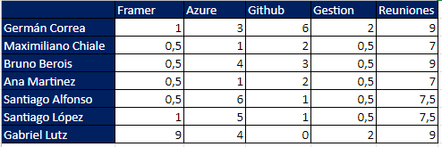

# Daily Scrums

Como ejemplo se incluye ejemplo de la asistencia de los integrantes del equipo a las reuniones virtuales por Teams.

Temas tratados:

  - ¿Que logramos hacer?
  - ¿Qué planificamos hacer?
  - ¿Qué impedimentos tenemos?

  ## Seguimiento de la iteración

### Burndown chart

Se observa el cumplimiento al final del sprint de la realizacion de todas las US planificadas.

También se puede ver el progreso de la productividad del equipo.
Si bien el gráfico de Azure hace un promedio con el primer Sprint donde no hubo trabajo en UserStories, podemos ver que se realizaron 115 Story Points en comparacion con los 50 del sprint anterior.

### Dedicacion horaria

Se incluye una planilla con el tiempo dedicado por cada uno de los integrantes del equipo.

Tareas principales realizada por cada integrante del equipo:

- Maxi
  - Participación en las distitnas reuniones
  - Creación/Modificación de User Stories
  - Trabajo en Framer
  
- Bruno
  - Participación en las distitnas reuniones
  - Creación/Modificación de User Stories
  - Trabajo en Framer

- Santiago Alfonso
  - Participación en las distitnas reuniones
  - Creación/Modificación de User Stories
  - Trabajo en Framer

- Santiago Lopez
  - Participación en las distitnas reuniones
  - Creación/Modificación de User Stories
  - Trabajo en Framer

- Belén Martinez
  - Participación en las distitnas reuniones
  - Creación/Modificación de User Stories
  - Trabajo en Framer

- Gabi
  - Participación en las distitnas reuniones
  - Creación/Modificación de User Stories
  - Trabajo en Framer

- Germán
  - Participación en las distitnas reuniones
  - Creación/Modificación/Adustes de User Stories
  - Trabajo en Framer