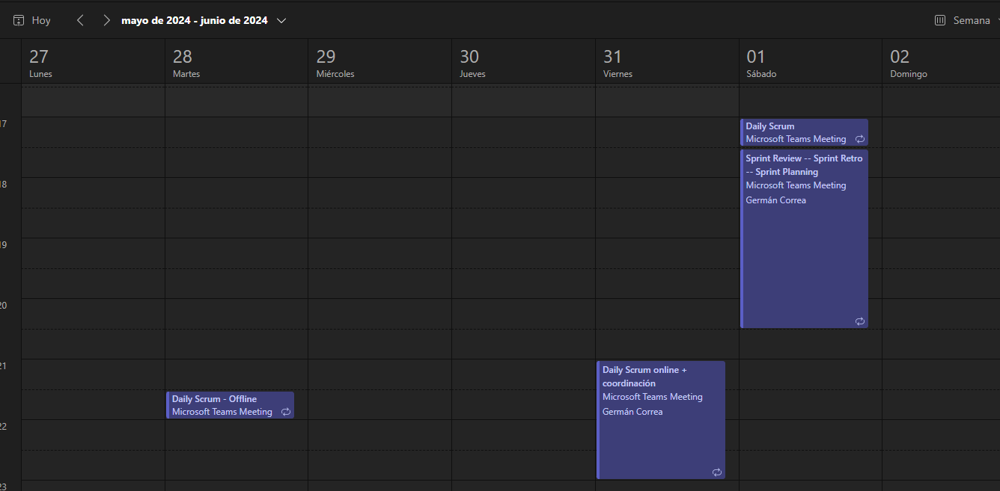
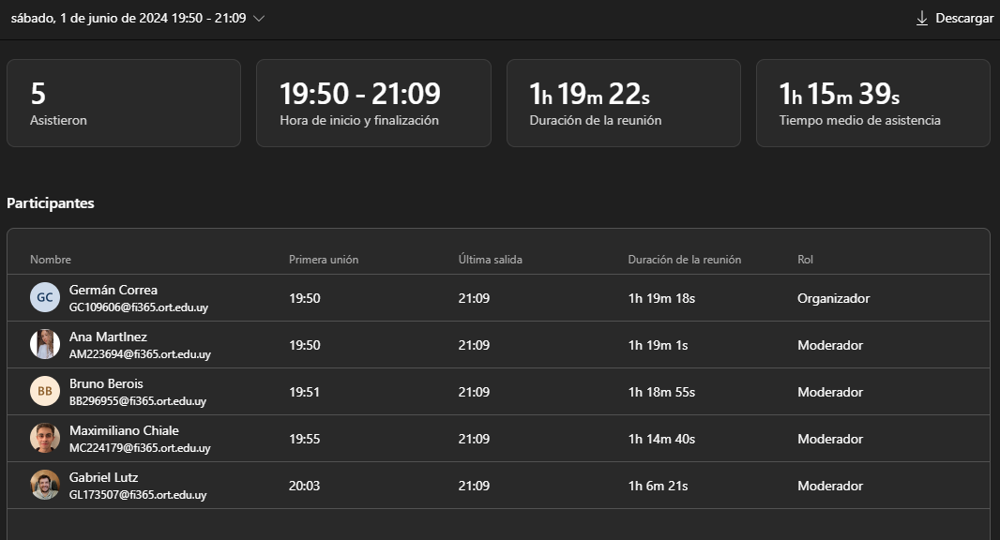
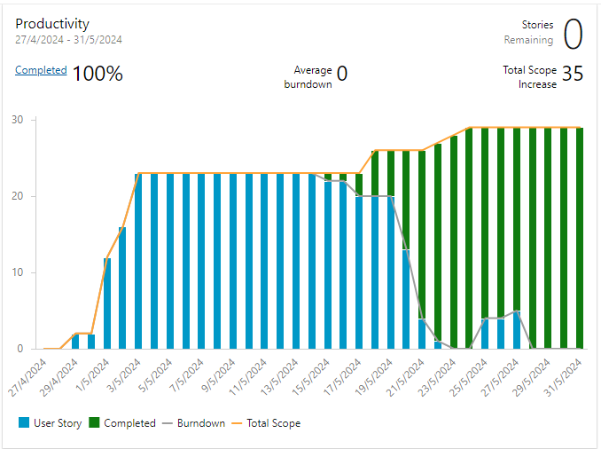
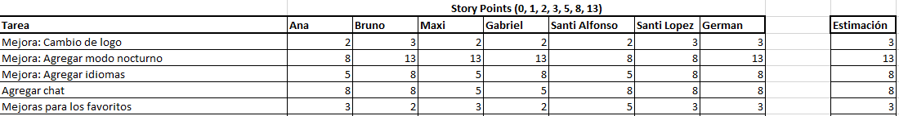

# Sprint Planning

### Cita

Realizada el 1/6/2024

 

 

## Agenda

- Establecer la capacidad del equipo para cada integrante en horas
- Repasar la Velocity del equipo en los sprint anteriores, hasta donde se pueda establecer (mejor, peor, promedio).
- Definir los objetivos de la iteración
- Seleccionar del backlog general priorizado, el conjunto de UserStories que se desean incluir en el Sprint alineadas con ese objetivo, contemplando las que aporten el mayor valor.
- Actualizar la estimación de esas UserStories
- Hacer el breakdown en Tasks de las US seleccionadas
- Hacer las estimaciones de las Tasks en horas.
- Estableder la prioridad de las UserStory dentro del Sprint, según el valor aportado
- Hacer las asignaciones de acuerdo a la capacidad de cada integrante

## Ejecución

### Capacidad del equipo

Como no se pudo dedicar todas las horas que se planificó en el Sprint anterior, se tiene que dedicar algo de tiempo en este sprint a terminar algunas US que quedaron, además de a las nuevas US que surgen como mejoras a partir de las reviews con usuarios.
También hay que dedicar tiempo a la preparación de la documentación, video y presentación final.
O sea que se toma una **capacidad de 5hs/persona/semana** en promedio, pero dado que parte de este tiempo se utilizará para el informe final, video, y presentación, quedará solo una parte para User Stories.

### Velocity de sprints anteriores

Tenemos los siguientes datos:
- Sprint 2 con 50 puntos. Peor caso.
- Sprint 3 con 115 puntos. Mejor caso.
- Promedio: 82,5 puntos/sprint

También se puede ver el progreso de la productividad del equipo.
Podemos ver que se realizaron 115 Story Points en comparación con los 50 del sprint anterior.

Se incluye la vista de la evolución de la cantidad de work items realizados a lo largo del tiempo como referencia adicional de productividad.

### Objetivos de la iteración

- Implementar las User Stories que no se pudieron finalizar en el Sprint 3, especialmente las sugerencias de los usuarios que agregan un valor diferencial a la APP y que es viable hacer dentro de las otras actividades programadas para este sprint como ser la elaboración de la documentación, e informes, video y presentación.
- Tener un review final con usuarios, especialmente con aquellos que hicieron sugerencias de mejora, que se decidan incluir en el sprint.

### User Stories seleccionadas para incluir en el Sprint

Para este Sprint se considera lo que no se pudo terminar del sprint 3 y también las sugerencias recibidas en las User Reviews.

Se ajustan las prioridades de las User Stories según el valor que aportan en conjunto con el Product Owner.

Se estiman las User Stories nuevas (las que provienen sugerencias de usuarios), y se seleccionan las siguientes para agregar al Sprint Backlog.

La técnica de estimación utilizada fué la de Story Points utilizando números de Fibnoacci.

 

Se incluye la planilla con las estimaciones del equipo y cuales fueron las finalmente consensuadas.

### Sprint backlog final

Luego de hacer el breakdown en tareas de cada User Story y estimarlas, se incluyen la captura de las Task y User Stories que quedaron para el Sprint, una vez asignadas.

