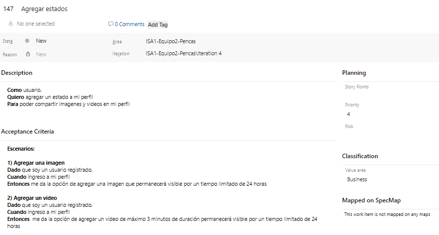
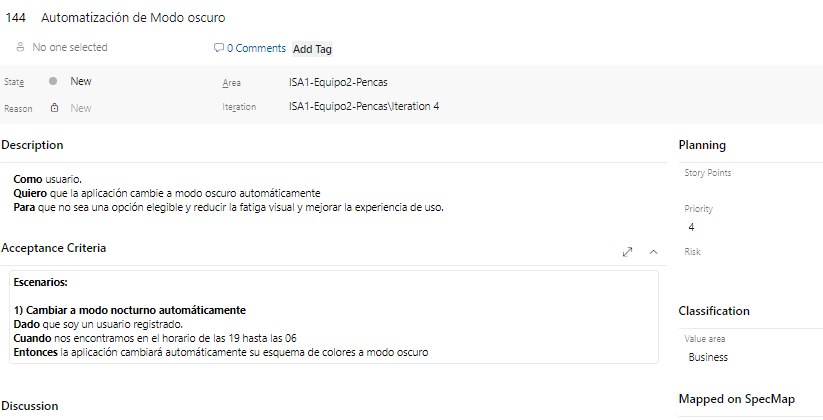
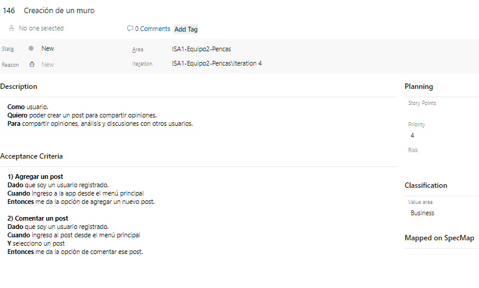
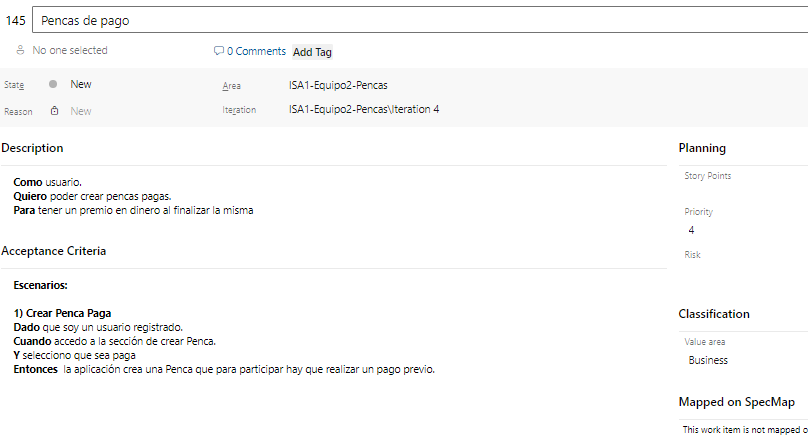

# Mejoras sugeridas por usuarios

Estas surgen del análisis realizado en el Sprint Review de la iteración anterior.

Para validar los prototipos diseñados y buscar oportunidades de mejora, llevamos a cabo una serie de pruebas de usabilidad con nuestra aplicación. En estas pruebas, invitamos a un grupo de posibles usuarios finales a interactuar con la aplicación, permitiéndoles usar y navegar por todas sus funcionalidades.

Durante las sesiones de prueba, los usuarios pudieron explorar cada característica y opción disponible en la aplicación, lo que nos proporcionó una visión realista de cómo se comportarían en un entorno cotidiano. Posteriormente, les realizamos una breve encuesta con el objetivo de comprender sus percepciones generales sobre la aplicación. Queríamos saber qué les parecía en términos generales, qué aspectos sentían que se podían mejorar, y qué funcionalidades consideraban que faltaban y que la aplicación debería incorporar en el futuro.

El resultado de estas pruebas fue altamente satisfactorio. La gran mayoría de los participantes coincidió en que la aplicación era muy intuitiva y fácil de usar. Este feedback positivo nos reafirma que estamos en el camino correcto en cuanto al diseño y la experiencia de usuario. No obstante, los usuarios también señalaron varios puntos que no habíamos considerado inicialmente. Estos comentarios fueron invaluables, ya que nos ofrecen una perspectiva fresca y nos ayudan a identificar áreas de mejora que podemos implementar en futuras versiones de la aplicación.

## Contenido generado con usuarios y análisis sobre el mismo

### Rodrigo Urán

- **Edad**: 38
- **Sexo**: Masculino
- **Profesión o actividad de la persona**: Psicólogo
- **Hobbies**: Entrenar, fútbol y pasear a mis perros.
- **Vinculo con pencas**: Usuario ocasional de Penca Ovación y Supermatch. Si participa de apuestas deportivas.
- **Revisión de nuestra APP**
    - **¿Opinión general?** Me gustó la aplicación, es dinámica, concreta en cuanto a lo que hay que hacer para que funcione y sea entretenida. 
    - **¿Qué le parece que se debería mejorar?** El logo no me indica de que se trata la aplicación, parece más agencia de viajes.
    - **¿Alguna característica que le parece que le falta?** Monetizar la aplicación, sería más entretenida para el usuario ganar un premio material. Para todo aquel que quiera participar. La aplicación se queda con un porcentaje y el resto es de premios. 

- Primer Demostración: [Primer Demostración Rodrigo](https://fi365-my.sharepoint.com/:v:/g/personal/gl173507_fi365_ort_edu_uy/EdAYFvrtCANHuis5BlJeRaoByOQUKVct6FDOC0XDMYiE7Q?e=RYjZPX)

### Felipe Carranza

- **Edad**: 35
- **Sexo**: Masculino
- **Profesión o actividad de la persona**: Mago
- **Hobbies**: Magia y Tenis.
- **Vinculo con pencas**: Usuario ocasional de Penca Ovación. Participa de apuestas deportivas.
- **Revisión de nuestra APP**
    - **¿Opinión general?** Es muy intuitiva y cualquiera que esté familiarizado con aplicaciones la podría manejarla y entenderla, sabiendo como invitar, crear grupos y pencas, etc. Es fácil para el usuario.
    - **¿Qué le parece que se debería mejorar?** Cambiaría cosas de diseño, colores, logo, tipografías, etc. Si se entra a una penca, podría ser gratuita o de pago, y que la aplicación tenga plataforma de pagos conectada a mercado pago o entidades bancarias y que los premios se dividan entre los 3 primeros puestos.
    - **¿Alguna característica que le parece que le falta?** Que tenga una especie de interacción entre los participantes (grupo de amigos o público) en el que cada uno pueda hacer comentarios y el resto leerlos y el usuario se sienta parte de la aplicación, y que genere un sentido de pertenencia y familiaridad con la aplicación, generando la posibilidad de tener debates. 

- Primer Demostración: [Primer Demostración Felipe](https://fi365-my.sharepoint.com/:v:/g/personal/gl173507_fi365_ort_edu_uy/EdspmK8B3xxKrYO_WeQk1mcBEc4Nu6qU9qAd84-KwvFZnw?e=hDedrJ)

### Yuly Goycoechea

- **Edad**: 47
- **Sexo**: Femenino
- **Profesión o actividad de la persona**: Contadora
- **Hobbies**: Leer y Viajar.
- **Vinculo con pencas**: No es usuario de Pencas. No participa de apuestas deportivas.
- **Revisión de nuestra APP**
    - **¿Opinión general?** Fácil de usar, con solo ver las opciones se entiende que hace cada funcionalidad.
    - **¿Qué le parece que se debería mejorar?** Tener la aplicación con mas idiomas. Vivo en Frontera y allí se habla mucho portugués, por ejemplo. Tener esa accesibilidad y posibilidad de cambiar idioma o tamaño de letras seria de ayuda.
    - **¿Alguna característica que le parece que le falta?** Le agregaría un chat para comentar en el grupo, no solo durante la penca, sino que se pueda usar para interactuar siempre. 

- Primer Demostración: [Primer Demostración Yuly](https://fi365-my.sharepoint.com/:v:/g/personal/gl173507_fi365_ort_edu_uy/EfXCYuPFTiVIlZZXkS7gyWMBe7WotQHpQWHNSq5jyt9YNg?e=kn936n)

### Adolfo Lutz

- **Edad**: 70
- **Sexo**: Masculino
- **Profesión o actividad de la persona**: Jubilado
- **Hobbies**: Leer y Cine.
- **Vinculo con pencas**: Usuario ocasional de penca Ovación. 
- **Revisión de nuestra APP**
    - **¿Opinión general?** Me gustó mucho, es fácil de manejar. Tienes mucha información sobre el los equipos que van a jugar y eso es bueno para dar un pronóstico. Haber puesto las apuestas oficiales y un enlace para hacerlas pareció acertado, ya que fue lo que había pedido cuando me entrevistaron anteriormente. 
    - **¿Qué le parece que se debería mejorar?** Me parece que está muy bien como está.  
    - **¿Alguna característica que le parece que le falta?** Me gustaría que tenga un modo nocturno, ya que a mi edad los brillos del móvil me molestan mucho con fondo blanco. 

- Primer Demostración: [Primer Demostración Adolfo](https://fi365-my.sharepoint.com/:v:/g/personal/gl173507_fi365_ort_edu_uy/EU9VgkJ23Q5CtuCJPgyePzcBFBU9gQM08gp6qgGIoj1Q1A?e=IxWTdY)

### Carlos Fernández

- **Edad**: 53
- **Sexo**: Masculino
- **Profesión o actividad de la persona**: Empleado estatal
- **Hobbies**: Jardinería
- **Vinculo con pencas**: Usuario ocasional de Penca Ovación. No participa de apuestas deportivas.
- **Revisión de nuestra APP**
  - **¿Opinión general?** Muy amigable la forma de manejarse en la aplicación. Los gráficos están bien.
  - **¿Qué le parece que se debería mejorar?** En la pantalla de inicio algo más relacionado con deportes (pelotas, raquetas, etc.)
  - **¿Alguna característica que le parece que le falta?** Los favoritos solo se eligen y no se hace nada con ellos, por lo que estaría bueno anexarle algo que de información acerca de ellos (Noticias importantes de cada club, jugador o partido).
  - **Analisis con el usuario**: Con esto te puede tener enganchado a la aplicación sin necesidad de estar participando en una penca, ya que te mantiene notificando y teniendo presente la app.

- Primer Demostración: [Primer Demostración Carlos](https://fi365-my.sharepoint.com/:u:/g/personal/gl173507_fi365_ort_edu_uy/EY2hOGhwpR5Jgnena6ta2qoBAmOzVU8PtBrwy1Xr4VTwzQ?e=a9UrSd)

## Mejoras SI implementadas

### #129 Mejora: Cambio de logo 

Video explicativo: [US #129](https://fi365-my.sharepoint.com/:v:/g/personal/sa276280_fi365_ort_edu_uy/ETYmn5f4hINFt182nNF_T-MBdQ63fFOSqTnpZ8asvPyxLw?e=li4PSa)

 
 
 

### #130 Mejora: Agregar modo nocturno

Video explicativo: [US #130](https://fi365-my.sharepoint.com/:v:/g/personal/sa276280_fi365_ort_edu_uy/ETYmn5f4hINFt182nNF_T-MBdQ63fFOSqTnpZ8asvPyxLw?e=li4PSa)

 
 
    

### #131 Mejora: Agregar idiomas

Video explicativo: [US #131](https://fi365-my.sharepoint.com/:v:/g/personal/sa276280_fi365_ort_edu_uy/EbLuHSbLbZVJoycxypKwJ40Bno_YCdSw7oko7et-P6UcWw?e=AMl5HO)

  
  

### #132 Mejora: Agregar chat

Video explicativo: [US #132](https://fi365-my.sharepoint.com/:v:/g/personal/sa276280_fi365_ort_edu_uy/EUuPPutG551KjWmyH2_IplEB0TAgqybAXMpo1obHR6SPug?e=gnpEwy)

 

 

### #133 Mejoras para los favoritos

Video explicativo: [US #133](https://fi365-my.sharepoint.com/:v:/g/personal/sa276280_fi365_ort_edu_uy/EY4W7lw-_Q1JjmlYhQeyQBoBr0Ni19ZvJAPFob9D2v56Cw?e=37RgwX)

 

 

## Mejoras NO implementadas (quedaron fuera del alcance del proyecto)

A continuación, mostraremos en detalle las principales funcionalidades que fueron descartadas, junto con su historia de usuario asociada y una breve justificación de por qué no se implementaron.

### Agregar estados: 

En cierto momento se consideró la idea de añadir funcionalidades parecidas a las de las redes sociales como permitir a los usuarios subir historias y fotos en la 
aplicación, pero decidimos no implementarlas. Nuestra aplicación está centrada en pronósticos deportivos, y agregar estas funciones podría desviar el enfoque 
principal y sobrecargar la experiencia del usuario. Estos requerimientos fueron solicitados por el público juvenil, que tiene una inclinación natural hacia el uso 
de este tipo de funcionalidades, sin ser demandantes. 

Además, la implementación de estas características podría complicar el desarrollo y mantenimiento de la app, desviando recursos y atención de nuestro objetivo 
principal. La inclusión de funciones de redes sociales también podría diluir la propuesta de valor única de la aplicación y hacerla menos atractiva para los 
usuarios que buscan una plataforma dedicada exclusivamente a los pronósticos deportivos. Por estas razones, optamos por mantenernos enfocados en mejorar y optimizar 
las funciones centrales relacionadas con los pronósticos, asegurando así una experiencia de usuario más coherente y efectiva. 

### Automatización de modo oscuro:

Un usuario también solicito el modo oscuro automático, pero al ya tener implementado el modo oscuro manual funcionando adecuadamente y satisfaciendo las necesidades de los usuarios, implementar un modo oscuro automático no nos pareció relevante o prioritario en términos de beneficio adicional. 

### Creación de un muro: 

También consideramos la idea de permitir a los usuarios publicar e interactuar en muros dentro de la aplicación. Sin embargo, debido a las limitaciones de tiempo y la priorización de otras funcionalidades que aportaban mayor valor, decidimos no implementar esta característica. Aunque probablemente habría sido interesante y beneficioso para fomentar la interacción entre los usuarios y enriquecer la experiencia de la comunidad. 

### Pencas de pago:
 

Otra funcionalidad no agregada fue la de tener pencas pagas, en las que se debería pagar antes para acceder a ella. Decidimos mantener las pencas gratuitas ya que de esta forma nos alineamos con una estrategia de crecimiento y validación del producto antes de introducir cualquier componente de pago, lo cual es una decisión estratégica para establecer una base sólida y preparar el terreno para futuras expansiones y monetización.

## Feedback luego de los cambios

#### Carlos Fernández

- **Edad**: 53
- **Sexo**: Masculino
- **Profesión o actividad de la persona**: Empleado estatal
- **Hobbies**: Jardinería
- **Vinculo con pencas**: Usuario ocasional de Penca Ovación. No participa de apuestas deportivas.
- **Revisión de nuestra APP**
Revisión de nuestra APP: 
    - **¿Opinión general?** Lo que me parece así, viendo con los arreglos estos es que quedó muy completa. Una aplicación que no solo es de pronósticos, sino que tiene otras cosas que se pueden ver. Me parece que está muy bien y habría que poder apostar y con eso ya cerraríamos todo. 
    El tema de las apuestas es una propuesta que nos habían dado pero quedó fuera del alcance, lo que se va a tener en cuenta para el siguiente reléase. 
    - **¿Qué le parece las mejoras que se introdujeron?** Perfecto, era lo que me parecía a mi y está muy bien. 

- Audio Review Final: [Review Final Carlos](https://fi365-my.sharepoint.com/:v:/g/personal/gl173507_fi365_ort_edu_uy/EeJBlwQdfLBPl4biwPwZsoEB5MXegFWQZMCBeM3DGmKJVA?e=FWEx3V)

#### Rodrigo Urán

- **Edad**: 38
- **Sexo**: Masculino
- **Profesión o actividad de la persona**: Psicólogo
- **Hobbies**: Entrenar, fútbol y pasear a mis perros.
- **Vinculo con pencas**: Usuario ocasional de Penca Ovación y Supermatch. Si participa de apuestas deportivas.
- **Revisión de nuestra APP**
    - **¿Opinión general?** Primero te quiero decir que el logo quedó mucho mas claro, lo veo ahora me doy cuenta que realmente es una aplicación que trata de deportes. También me gusto mucho, algo que no había notado que hubiera estado bueno que cuando seleccionas equipos o deportistas favoritos te largue información de actualidad o cuando juegan y es algo que me gustó mucho y me parece muy interesante. 
    Después te quería preguntar, porque no me lo comentaste, de la monetización de la aplicación, si se pudo hacer algo. 
    - **Esa propuesta nos interesó, nos daba valor a la aplicación, pero quedó fuera del alcance, lo que se va a tener en cuenta para el siguiente reléase para implementar.** 
    Muchas gracias, muy bueno y que tengan mucha suerte 

- Audio Review Final: [Review Final Rodrigo](https://fi365-my.sharepoint.com/:v:/g/personal/gl173507_fi365_ort_edu_uy/EezKh0oyHpNNkkHTbv264g0BcaOpzRFAfxGCt4s3mNyXIA?e=HMmsHK)

#### Felipe Carranza

- **Edad**: 35
- **Sexo**: Masculino
- **Profesión o actividad de la persona**: Mago
- **Hobbies**: Magia y Tenis.
- **Vinculo con pencas**: Usuario ocasional de Penca Ovación. Participa de apuestas deportivas.
- **Revisión de nuestra APP**
    - **¿Opinión general?** Veo que el logo está cambiado, y está bueno porque comunica mucho mejor cual es la función de la app, está bueno que se incluyeron todos los deportes. Te había dicho que me hubiera gustado que tenga un chat y veo que lo incorporaron. Eso está bueno porque te va a dar más dinámica y más funciones a la aplicación. 
    Después también te había consultado para poder hacer pencas pagas, que el usuario pueda pagar. 
    - **No lo hicimos porque quedó fuera del alcance, si bien lo contemplamos porque nos puede dar mucho valor y quedará para el siguiente release.** 
    Perfecto, ya la quiero descargar. 

- Audio Review Final: [Review Final Felipe](https://fi365-my.sharepoint.com/:v:/g/personal/gl173507_fi365_ort_edu_uy/EQqcUrQJ2FBOrgAeBKEle4ABGVb-UZgx8OnPXGMHe1M6TQ?e=a3u4fs)

#### Yuly Goycoechea

- **Edad**: 47
- **Sexo**: Femenino
- **Profesión o actividad de la persona**: Contadora
- **Hobbies**: Leer y Viajar.
- **Vinculo con pencas**: No es usuario de Pencas. No participa de apuestas deportivas.
- **Revisión de nuestra APP**
    - **¿Opinión general?** Me gustó como quedó todo, el que tengan en cuenta lo que les comenté en la entrevista anterior me dejó muy contenta. 
    - **¿Qué le parece las mejoras que se introdujeron?** El chat quedó muy bien logrado y va a permitir que la gente participe e interactúe en todo momento. Después los idiomas quedaron fáciles de usar y cambiar. Los felicito por el trabajo  

- Audio Review Final: [Review Final Yuly](https://fi365-my.sharepoint.com/:v:/g/personal/gl173507_fi365_ort_edu_uy/EYXJRCK39ytDrOtj_-IGnroBPwAVQ7RkHb9--musLzYjzQ?e=LI4qqr)

#### Adolfo Lutz

- **Edad**: 70
- **Sexo**: Masculino
- **Profesión o actividad de la persona**: Jubilado
- **Hobbies**: Leer y Cine.
- **Vinculo con pencas**: Usuario ocasional de penca Ovación. 
- **Revisión de nuestra APP**
    - **¿Opinión general?** Me gustó mucho. No me había dado cuenta lo del uso de favoritos, y con lo de leer noticias está muy bueno, porque te mantiene informado y no solo para hacer apuestas.  
    - **¿Qué le parece las mejoras que se introdujeron?** Yo les había comentado lo del modo oscuro y me gustó como quedo, además es fácil de poner y sacar. Ahora si la uso mucho tiempo no me van a molestar los ojos.  
    En una siguiente etapa podría ser automático sin tener que modificarlo, como pasa con una aplicación que uso que se llama Waze, que te lo cambia directamente despues de las 19 hs. 

- Audio Review Final: [Review Final Adolfo](https://fi365-my.sharepoint.com/:v:/g/personal/gl173507_fi365_ort_edu_uy/Ed06lwUiSBFMrMtvwSOKdeQBFl3obk-WWvTPwKHzX0jTFw?e=OyWhM1)